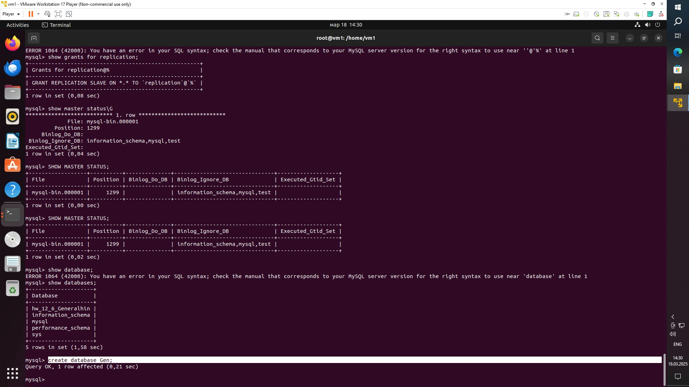
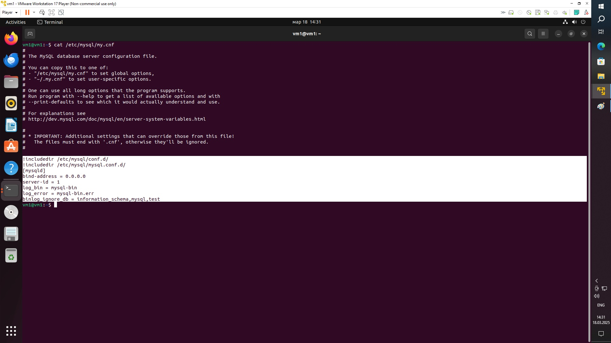
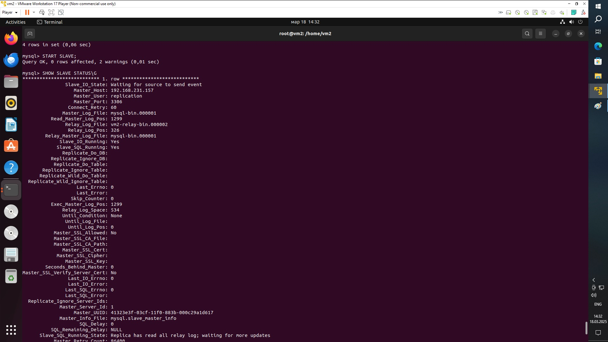
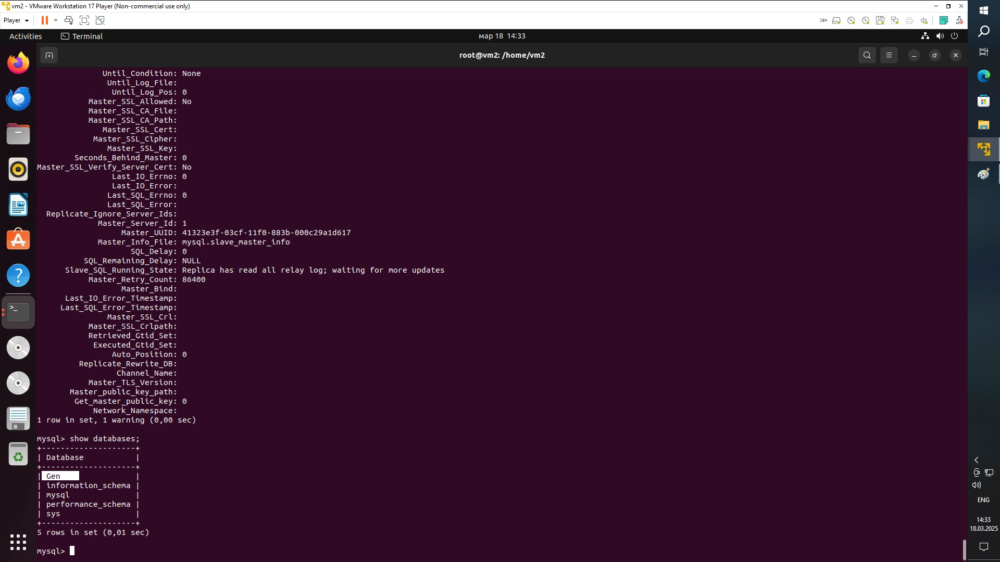
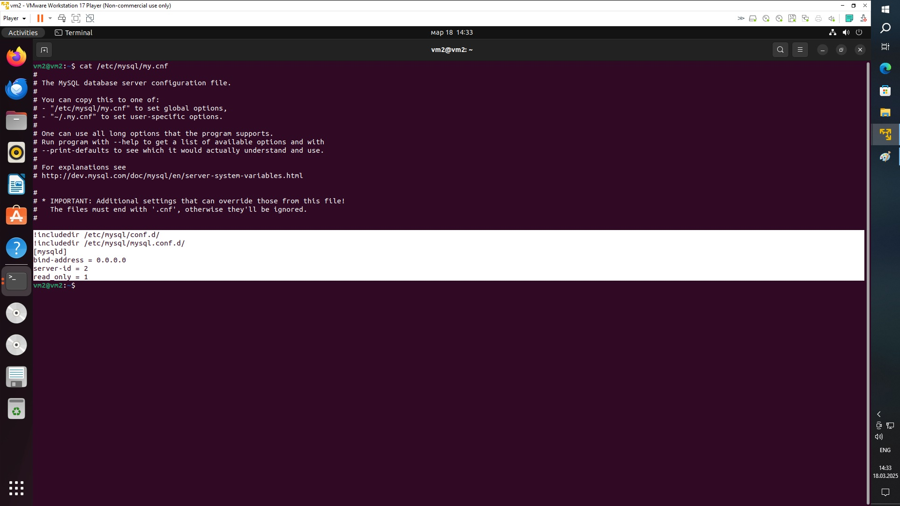

#Задание 1
На лекции рассматривались режимы репликации master-slave, master-master, опишите их различия.

Ответить в свободной форме.

При режиме master-slave все манипуляции с данными производятся на "мастере", а "слэйв" реплицирует внесённые изменения с "мастера".

Режим master-master по сути тот же master-slave, где "мастеру" добавляется роль "слэйва", и он будет реплицировать данные с того сервера, что был "слэйвом". Работа в данном режиме - нежелательна, т.к. может привести к потерям данных.

#Задание 2
Выполните конфигурацию master-slave репликации, примером можно пользоваться из лекции.

Приложите скриншоты конфигурации, выполнения работы: состояния и режимы работы серверов.

